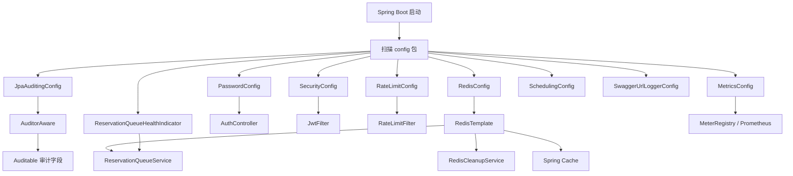
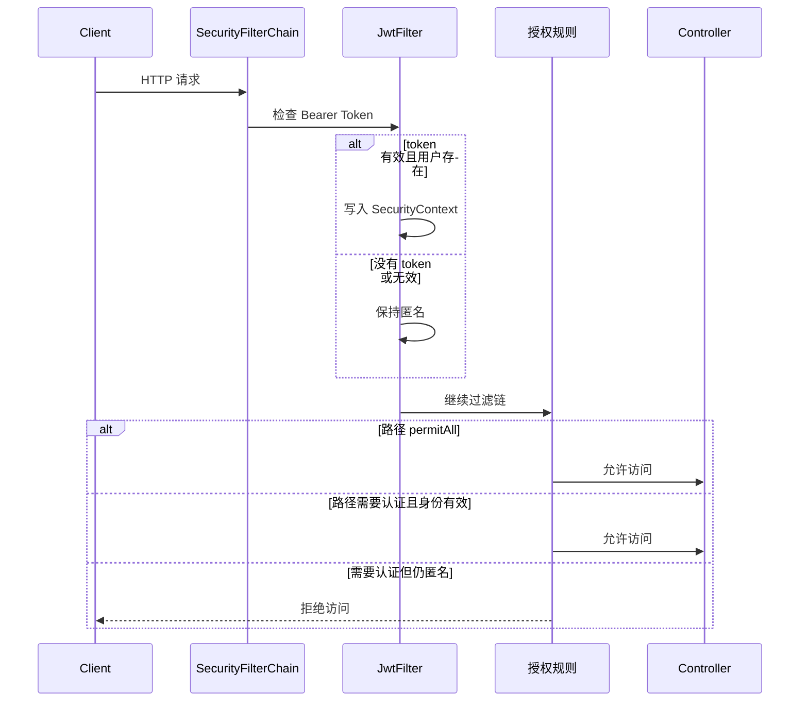

# `config` 包配置类详细导读

> 分析路径：`src/main/java/com/azki/reservation/config`  
> 分析日期：2026-09-14  
> 本文以当前工作区代码为准，既解释设计目的，也标出当前代码的实际行为和注意事项。

## 1. `config` 包整体负责什么

`config` 包不是用来编写预约业务规则的，而是负责告诉 Spring：

- 系统需要创建哪些公共对象（Bean）；
- 这些对象如何初始化；
- 哪些框架能力需要开启；
- HTTP 请求需要经过哪些安全规则；
- Redis、密码、指标、审计和健康检查如何工作。

业务类通常不自己 `new` 这些基础设施对象，而是在构造方法中声明依赖，由 Spring 从容器中注入。例如：

```text
PasswordConfig 创建 PasswordEncoder
    -> Spring 保存该 Bean
    -> AuthController 声明需要 PasswordEncoder
    -> Spring 自动把同一个 Bean 注入 AuthController
```

当前包包含 10 个 Java 文件：

| 文件 | 核心作用 | 主要产物/行为 |
|---|---|---|
| `AuditorAwareImpl.java` | 判断“当前是谁在操作数据” | 当前用户名或 `system` |
| `JpaAuditingConfig.java` | 开启 JPA 自动审计 | `AuditorAware<String>` Bean |
| `MetricsConfig.java` | 注册预约耗时指标 | 两个 Micrometer `Timer` |
| `PasswordConfig.java` | 配置密码哈希算法 | `PasswordEncoder` Bean |
| `RateLimitConfig.java` | 配置令牌桶限流 | Bucket4j `Bucket` Bean |
| `RedisConfig.java` | 配置 Redis 连接和序列化 | 连接工厂、`RedisTemplate` |
| `ReservationQueueHealthIndicator.java` | 判断队列是否健康 | Actuator 自定义健康项 |
| `SchedulingConfig.java` | 开启并集中控制后台定时任务 | 条件化启用 `@Scheduled` |
| `SecurityConfig.java` | 配置 HTTP 安全规则 | `SecurityFilterChain` Bean |
| `SwaggerUrlLoggerConfig.java` | 启动后打印接口文档地址 | 启动事件监听器 |

## 2. 阅读配置代码前需要理解的 Spring 注解

### 2.1 `@Configuration`

表示这个类是一个“配置类”。Spring 启动扫描到它后，会读取其中的 `@Bean` 方法。

它本身也会成为 Spring 容器管理的对象。配置类中的 `@Bean` 默认按单例管理：应用生命周期内通常只有一个实例，而不是每次注入都重新创建。

### 2.2 `@Bean`

加在方法上，表示方法返回值需要交给 Spring 容器管理。默认 Bean 名就是方法名，例如：

```java
@Bean
public PasswordEncoder passwordEncoder() { ... }
```

返回对象的类型是 `PasswordEncoder`，默认 Bean 名是 `passwordEncoder`。其他类只要在构造方法中声明 `PasswordEncoder`，Spring 就会自动注入它。

`@Bean` 方法的参数也由 Spring 注入。例如 `redisTemplate(RedisConnectionFactory connectionFactory)` 中的连接工厂不是手动传入的，而是 Spring 从容器里找到后传给该方法。

### 2.3 `@Component`

表示当前类本身就是一个需要被 Spring 管理的组件。它和 `@Bean` 的区别是：

- `@Component` 标记在类上，由组件扫描发现；
- `@Bean` 标记在配置方法上，常用于创建第三方库对象，或者需要定制创建过程的对象。

### 2.4 `@Value`

将 YAML、环境变量或启动参数中的配置值注入字段。例如：

```java
@Value("${spring.data.redis.host:localhost}")
private String redisHost;
```

表示优先读取 `spring.data.redis.host`；没有配置时使用 `localhost`。冒号后面是默认值。

### 2.5 条件配置

`@ConditionalOnProperty` 表示只有配置项满足条件时，配置类或组件才会创建。这个项目使用它控制限流功能是否启用。

## 3. 配置对象的整体关系



## 4. `AuditorAwareImpl.java`

### 4.1 文件作用

这个类回答一个问题：**当 JPA 新增或修改一条记录时，当前操作人是谁？**

实体基类 `Auditable` 中有这些字段：

- `@CreatedBy`：创建人；
- `@CreatedDate`：创建时间；
- `@LastModifiedBy`：最后修改人；
- `@LastModifiedDate`：最后修改时间。

时间由 JPA 自动生成，而创建人和修改人需要 `AuditorAware<String>` 提供。

### 4.2 类声明

```java
@Component
public class AuditorAwareImpl implements AuditorAware<String>
```

- `@Component`：让组件扫描把该类实例注册进 Spring 容器；
- `implements AuditorAware<String>`：实现 Spring Data 约定的审计人接口；
- 泛型 `String`：说明审计字段中的操作人以字符串保存，本项目保存邮箱或 `system`。

### 4.3 `getCurrentAuditor()`

```java
Authentication authentication =
    SecurityContextHolder.getContext().getAuthentication();
```

`SecurityContextHolder` 保存当前线程的认证上下文。JWT 通过验证后，`JwtFilter` 会把用户邮箱放进这里。

```java
if (authentication == null || !authentication.isAuthenticated()) {
    return Optional.of("system");
}
```

没有身份或身份未认证时，返回 `system`。这通常发生在：

- 应用启动初始化数据；
- 后台定时任务；
- 匿名访问接口；
- 没有携带有效 JWT 的请求。

```java
return Optional.of(authentication.getName());
```

认证存在时返回认证对象名称。当前 `JwtFilter` 把用户邮箱设置为 principal，因此 `getName()` 最终通常得到邮箱。

### 4.4 实际效果

保存实体时，数据可能变成：

```text
created_by = user@example.com
created_date = 当前时间
last_modified_by = user@example.com
last_modified_date = 当前时间
```

匿名或定时任务产生的数据则会记录为 `system`。

### 4.5 注意事项

当前预约接口在 `SecurityConfig` 中被匿名开放。用户即使不带 JWT 也能预约，因此这些请求写入的审计人会是 `system`，而不是请求 DTO 中的邮箱。

## 5. `JpaAuditingConfig.java`

### 5.1 文件作用

开启 Spring Data JPA 的自动审计功能，并指定使用哪个 Bean 获取当前操作人。

### 5.2 `@EnableJpaAuditing`

```java
@EnableJpaAuditing(auditorAwareRef = "auditorAware")
```

它会启用对 `@CreatedBy`、`@CreatedDate`、`@LastModifiedBy`、`@LastModifiedDate` 的处理。

`auditorAwareRef = "auditorAware"` 明确指定 Bean 名。这里对应下面的方法名：

```java
@Bean
public AuditorAware<String> auditorAware() {
    return new AuditorAwareImpl();
}
```

Spring 调用该方法后，将返回对象以 `auditorAware` 为名称保存进容器。

### 5.3 完整调用链

```text
Repository.save(entity)
  -> Hibernate 准备 INSERT/UPDATE
  -> AuditingEntityListener 发现审计注解
  -> 调用名为 auditorAware 的 Bean
  -> AuditorAwareImpl 读取 SecurityContext
  -> 回填 createdBy 或 lastModifiedBy
  -> 执行 SQL
```

### 5.4 当前代码中的重复注册

`AuditorAwareImpl` 自己带有 `@Component`，同时 `JpaAuditingConfig` 又执行 `new AuditorAwareImpl()` 创建了第二个对象。因此容器中可能同时存在：

- 默认名为 `auditorAwareImpl` 的组件；
- 名为 `auditorAware` 的 `@Bean`。

审计功能通过名称明确选择 `auditorAware`，所以通常不会选错，但前一个 Bean 是冗余的。更简洁的写法可以二选一：

1. 保留 `@Component`，把 `auditorAwareRef` 改成 `auditorAwareImpl`；
2. 保留 `@Bean`，移除 `AuditorAwareImpl` 上的 `@Component`。

本文只解释现状，没有修改代码。

## 6. `MetricsConfig.java`

### 6.1 文件作用

使用 Micrometer 注册两个计时指标：

| Bean 方法 | 指标名 | 计划测量内容 |
|---|---|---|
| `reservationProcessingTimer` | `reservation.processing.time` | 完成一次预约所需时间 |
| `slotSelectionTimer` | `reservation.slot.selection.time` | 选择空闲时段所需时间 |

Micrometer 是 Spring Boot 的指标门面；Prometheus Registry 会把指标转换成 Prometheus 可抓取格式。

### 6.2 `MeterRegistry` 参数

```java
public Timer reservationProcessingTimer(MeterRegistry registry)
```

Spring Boot Actuator 自动配置 `MeterRegistry`。Spring 调用这个 `@Bean` 方法时自动将 Registry 传入，不需要本项目手动创建。

### 6.3 Timer 构建过程

```java
return Timer.builder("reservation.processing.time")
        .description("Time taken to process a reservation")
        .register(registry);
```

依次完成：

1. 创建指定名称的 Timer 构建器；
2. 添加指标说明；
3. 注册进全局指标仓库；
4. 返回同一个 Timer，供业务类注入和记录耗时。

记录耗时通常需要业务代码执行类似：

```java
timer.record(() -> reservationService.reserveNearestSlot(email));
```

或者使用 `Timer.Sample` 手动开始、停止计时。

### 6.4 当前实际状态

这两个 Timer 只被创建，没有被任何业务类注入或调用。它们可能出现在指标列表中，但不会积累有意义的调用次数和耗时数据。

当前项目其他 Counter 和 Gauge 是业务服务直接通过 `MeterRegistry` 注册的，例如：

- `reservation.success`；
- `reservation.failed`；
- `reservation.queue.length`；
- `reservation.active.requests`。

## 7. `PasswordConfig.java`

### 7.1 文件作用

向 Spring 容器提供统一的密码编码与校验组件。

```java
@Bean
public PasswordEncoder passwordEncoder() {
    return new BCryptPasswordEncoder();
}
```

方法返回接口类型 `PasswordEncoder`，具体实现是 `BCryptPasswordEncoder`。业务层只依赖抽象接口，未来更换算法时无需修改控制器字段类型。

### 7.2 BCrypt 是什么

BCrypt 是专门用于密码存储的单向哈希算法：

- 不能从哈希值还原明文；
- 每次编码自动加入随机盐；
- 可以通过工作因子提高计算成本，降低暴力破解速度。

登录代码使用：

```java
passwordEncoder.matches(loginRequest.getPassword(), user.getPassword())
```

参数含义是：

1. 第一个参数是客户端提交的明文密码；
2. 第二个参数是数据库中已保存的 BCrypt 哈希；
3. `matches` 用相同算法验证二者是否对应。

### 7.3 当前注意事项

Liquibase 初始化用户的密码是 `hashed_password_125` 一类占位文本，不是标准 BCrypt 哈希，因而无法通过这里的登录校验。真实用户密码应该在保存前调用 `passwordEncoder.encode(rawPassword)`。

## 8. `RateLimitConfig.java`

### 8.1 文件作用

创建 Bucket4j 令牌桶，限制单位时间内允许通过的请求数量。

### 8.2 条件启用

```java
@ConditionalOnProperty(
    value = "reservation.rate-limiting.enabled",
    havingValue = "true",
    matchIfMissing = false
)
```

含义是：

- 配置值明确等于 `true`：加载 `RateLimitConfig`；
- 配置值为 `false`：不加载；
- 配置项完全不存在：由于 `matchIfMissing=false`，也不加载。

`RateLimitFilter` 使用相同条件，因此配置关闭时，Bucket 和过滤器会一起消失，不会产生“过滤器找不到 Bucket Bean”的启动错误。

当前 `application.yml` 没有 `reservation.rate-limiting.enabled`，所以限流默认关闭。

### 8.3 容量和补充速率

```java
private static final int CAPACITY = 20;
private static final int TOKENS_PER_MINUTE = 20;
```

- `CAPACITY=20`：桶最多同时保存 20 个令牌；
- `TOKENS_PER_MINUTE=20`：每分钟补充 20 个；
- 过滤器每接受一个预约请求消费一个令牌。

```java
Refill.greedy(20, Duration.ofMinutes(1))
```

`greedy` 表示连续、平滑补充，而不是等到整分钟边界一次性补满。大致相当于平均每 3 秒补充一个令牌。

```java
Bandwidth.classic(CAPACITY, refill)
```

把“最大容量”和“补充策略”合成一条带宽限制。

```java
Bucket4j.builder().addLimit(limit).build()
```

创建最终 Bucket。因为这个 Bean 默认是单例，所以当前应用实例的所有调用者共享同一个桶，不区分用户、IP 或接口。

### 8.4 与过滤器的关系

`RateLimitFilter` 注入该 Bucket，并调用 `bucket.tryConsume(1)`：

- 消费成功：继续处理请求；
- 消费失败：返回 HTTP 429。

### 8.5 当前路径问题

限流过滤器判断的路径是 `/api/reservations`，真实控制器路径是 `/api/v1/reservations`。因此即便打开配置，当前预约接口仍不会进入限流分支。这个问题位于 `RateLimitFilter`，而不是本配置类本身。

## 9. `RedisConfig.java`

### 9.1 文件作用

该文件完成两件事：

1. 创建和管理 Redis 网络连接；
2. 规定 Java 对象如何转换成 Redis 中的字节数据。

它是配置包中代码最多、对业务影响最大的基础设施配置之一。

### 9.2 配置值注入

```java
@Value("${spring.data.redis.host:localhost}")
private String redisHost;
```

三个字段分别读取：

| 字段 | 配置项 | 默认值 |
|---|---|---|
| `redisHost` | `spring.data.redis.host` | `localhost` |
| `redisPort` | `spring.data.redis.port` | `6379` |
| `redisPassword` | `spring.data.redis.password` | 空字符串 |

本地运行时使用 YAML 中的 localhost；Docker Compose 会用环境变量把主机覆盖为容器服务名 `redis`。

### 9.3 `redisConnectionFactory()`

这个 Bean 负责创建底层 Redis 连接。

```java
RedisStandaloneConfiguration redisConfig =
    new RedisStandaloneConfiguration(redisHost, redisPort);
```

这里选择的是 Redis 单机模式，不是 Sentinel 或 Cluster。

```java
if (redisPassword != null && !redisPassword.isEmpty()) {
    redisConfig.setPassword(redisPassword);
}
```

只有密码非空才设置认证，允许本地无密码 Redis 直接运行。

#### 连接池参数

```java
poolConfig.setMaxTotal(10);
poolConfig.setMaxIdle(5);
poolConfig.setMinIdle(1);
```

- `maxTotal=10`：最多 10 个连接；
- `maxIdle=5`：池中最多保留 5 个空闲连接；
- `minIdle=1`：尽量至少保持 1 个空闲连接。

```java
poolConfig.setTestOnBorrow(true);
poolConfig.setTestOnReturn(true);
poolConfig.setTestWhileIdle(true);
```

- 借连接时检查是否有效；
- 还连接时再次检查；
- 后台检查空闲连接。

这样能减少拿到失效连接的概率，但每次借还都检查会增加少量开销。

#### Lettuce 客户端参数

```java
.commandTimeout(Duration.ofSeconds(2))
.shutdownTimeout(Duration.ZERO)
.poolConfig(poolConfig)
```

- 单条 Redis 命令最长等待 2 秒；
- 关闭客户端时不额外等待；
- 使用前面定义的 Commons Pool2 连接池。

最后返回 `LettuceConnectionFactory`。Lettuce 是 Spring Data Redis 默认使用的 Redis Java 客户端之一。

### 9.4 `redisTemplate()`

`RedisTemplate<String, Object>` 是业务服务实际使用的高级操作对象，例如：

- `opsForList()` 操作预约队列；
- `opsForValue()` 保存请求状态；
- `opsForSet()` 保存排队邮箱集合；
- `expire()` 设置 TTL；
- Spring Cache 通过 Redis 保存最近空闲时段。

```java
template.setKeySerializer(new StringRedisSerializer());
```

Redis Key 直接存为可读字符串，例如：

```text
reservation:queue
reservation:status:某个UUID
```

```java
template.setValueSerializer(new GenericJackson2JsonRedisSerializer());
```

Value 使用 Jackson JSON 序列化，能保存 DTO、队列消息、实体或字符串等不同类型。相对于 Java 原生序列化，JSON 更容易跨版本和人工排查。

Hash 的 key/value 也分别使用字符串和 JSON，保证各种 Redis 数据结构的编码风格一致。

### 9.5 使用者

当前明确注入 `RedisTemplate<String, Object>` 的类有：

- `ReservationQueueService`：主队列、DLQ、请求状态、邮箱去重；
- `RedisCleanupService`：状态键 TTL 和遗留键清理。

### 9.6 注意事项

- 当前只支持 Redis 单机，不支持高可用 Sentinel/Cluster；
- 连接池数字硬编码，不能按环境调节；
- 命令超时只有 2 秒，高负载环境需要结合实际延迟评估；
- 泛型配置使用原始 `GenericObjectPoolConfig`，可以改成带具体连接类型的泛型以减少警告；
- `RedisCleanupService` 使用 `RedisTemplate.keys()`，数据量大时可能阻塞 Redis，这不是 `RedisConfig` 本身的问题，但会使用这里创建的连接执行。

## 10. `ReservationQueueHealthIndicator.java`

### 10.1 文件作用

把预约队列积压情况接入 Spring Boot Actuator 健康检查。

```java
public class ReservationQueueHealthIndicator implements HealthIndicator
```

实现 `HealthIndicator` 后，Spring Boot 会自动把它加入 `/actuator/health` 的健康检查体系。

### 10.2 依赖注入

```java
private final ReservationQueueService reservationQueueService;
```

健康检查器不直接访问 Redis，而是通过队列服务的：

- `getQueueLength()`；
- `getDLQLength()`。

这样 Redis 键名等细节仍封装在队列服务中。

### 10.3 阈值

| 条件 | 返回状态 |
|---|---|
| 主队列 `<= 50` 且 DLQ `<= 10` | UP |
| 主队列 `> 50` 且 `<= 100` | WARNING |
| 主队列 `> 100` | DOWN |
| DLQ `> 10` | WARNING |

代码使用严格的大于号，所以恰好 50、100 或 10 时还不会跨入更高等级。

### 10.4 `Health.Builder`

```java
Health.Builder builder = Health.up()
    .withDetail("queueSize", queueSize)
    .withDetail("deadLetterQueueSize", dlqSize);
```

先按 UP 创建结果，并把两种队列长度放入详情。后续判断可以把同一个 Builder 改成 WARNING 或 DOWN。

主队列超过 100 时先返回 DOWN，因此严重积压优先于 DLQ 警告。

### 10.5 运行效果

在允许显示健康详情的配置下，结果结构大致如下：

```json
{
  "status": "WARNING",
  "components": {
    "reservationQueue": {
      "status": "WARNING",
      "details": {
        "queueSize": 70,
        "deadLetterQueueSize": 2
      }
    }
  }
}
```

组件名称通常由类名去掉 `HealthIndicator` 后得到，即 `reservationQueue`。

### 10.6 注意事项

- 阈值是硬编码常量，不能按环境配置；
- 每次健康检查都会访问 Redis；Redis 不可用时调用可能抛异常，由 Actuator 汇总为健康故障；
- `WARNING` 是自定义状态，监控系统是否把它视为异常需要额外配置；
- 应用把管理端口设为 8081，而 Docker 健康检查当前访问 8080，可能无法真正调用这个检查器。

## 11. `SecurityConfig.java`

### 11.1 文件作用

定义每个 HTTP 请求需要满足的安全规则，并决定 JWT 过滤器位于过滤链的什么位置。

### 11.2 类级注解

```java
@Configuration
@EnableWebSecurity
```

- `@Configuration`：这是 Spring 配置类；
- `@EnableWebSecurity`：启用 Spring Security Web 支持，并使用项目自定义的过滤链。

### 11.3 注入 `JwtFilter`

```java
public SecurityConfig(JwtFilter jwtFilter) {
    this.jwtFilter = jwtFilter;
}
```

`JwtFilter` 本身带 `@Component`，先被 Spring 创建，再通过构造方法注入配置类。

### 11.4 `SecurityFilterChain`

`SecurityFilterChain` 是 Spring Security 最核心的配置结果：一个请求进入 Controller 之前，需要按顺序经过这条链。

#### 关闭 CSRF

```java
.csrf(AbstractHttpConfigurer::disable)
```

项目使用 Bearer JWT，不依赖浏览器 Cookie 中的服务端会话，因此关闭 CSRF。若未来加入 Cookie 登录或浏览器表单，需要重新评估。

#### 路径授权

```java
.requestMatchers(
    "/api/auth/**",
    "/swagger-ui/**",
    "/v3/api-docs/**",
    "/api/v1/reservations/**"
).permitAll()
.anyRequest().authenticated()
```

含义是：

| 路径 | 当前规则 |
|---|---|
| 登录接口 | 匿名访问 |
| Swagger UI | 匿名访问 |
| OpenAPI JSON | 匿名访问 |
| 所有预约接口 | 匿名访问 |
| 其他业务接口 | 必须认证 |

因此创建预约、查状态和取消预约目前都不要求 JWT。特别是取消接口没有当前用户所有权校验，知道预约 ID 的匿名调用者就可能取消预约。

#### 无状态会话

```java
.sessionManagement(sess -> sess
    .sessionCreationPolicy(SessionCreationPolicy.STATELESS))
```

`STATELESS` 表示服务器不创建 HTTP Session 保存登录状态。客户端每次请求都应携带 JWT，服务器每次重新验证。

#### JWT 过滤器顺序

```java
.addFilterBefore(jwtFilter, UsernamePasswordAuthenticationFilter.class)
```

把 `JwtFilter` 放到 Spring 默认用户名密码过滤器之前。这样后续授权判断发生前，JWT 已有机会建立 `Authentication`。

### 11.5 请求过程



### 11.6 管理端点注意事项

`application.yml` 把 Actuator 放在独立管理端口 8081。管理上下文与主应用安全链的匹配方式需要结合 Spring Boot 实际自动配置验证，不能仅凭 `/actuator/**` 没出现在本文件中就断言一定被主过滤链保护或放行。

## 12. `SchedulingConfig.java`

### 12.1 文件作用

集中开启 Spring 的定时任务能力，使队列消费、预约过期清理和 Redis 状态清理方法上的 `@Scheduled` 真正生效。

```java
@Configuration
@EnableScheduling
@ConditionalOnProperty(
    prefix = "reservation.scheduling",
    name = "enabled",
    havingValue = "true",
    matchIfMissing = true
)
public class SchedulingConfig { }
```

- `@EnableScheduling`：让 Spring 扫描并注册所有 `@Scheduled` 方法；
- `@ConditionalOnProperty`：提供统一开关 `reservation.scheduling.enabled`；
- `matchIfMissing=true`：不写该配置时默认启用，保持生产和开发环境正常运行；
- 测试配置显式设为 `false`，防止后台线程抢先消费集成测试放入 Redis 的消息。

这项配置只决定定时任务是否运行，不改变各任务自己的执行间隔。队列轮询间隔由 `reservation.queue.poll-interval-ms` 控制，预约过期检查间隔由 `reservation.expiry.check-minutes` 控制。

## 13. `SwaggerUrlLoggerConfig.java`

### 13.1 文件作用

应用启动完成后，把 Swagger UI 地址以醒目的方框打印到日志，方便开发者点击或复制。

它不负责开启 Swagger。Swagger 功能来自 `pom.xml` 中的 Springdoc 依赖；这个类只负责打印地址。

### 13.2 `@Slf4j`

Lombok 在编译时自动生成：

```java
private static final Logger log = LoggerFactory.getLogger(...);
```

因此源码中虽然没有声明 `log` 字段，`log.info(...)` 仍然可以使用。

### 13.3 地址配置

```java
@Value("${server.port:8080}")
private int serverPort;

@Value("${server.servlet.context-path:}")
private String contextPath;
```

- 业务服务端口默认 8080；
- context path 默认空字符串；
- 若配置 `/reservation`，最终地址会包含该前缀。

```java
String baseUrl = "http://localhost:" + serverPort + contextPath;
String swaggerUrl = baseUrl + "/swagger-ui/index.html";
```

例如默认得到：

```text
http://localhost:8080/swagger-ui/index.html
```

### 13.4 `@EventListener(ApplicationStartedEvent.class)`

这表示当 Spring Boot 发布 `ApplicationStartedEvent` 时调用 `logSwaggerUiUrl()`。

该事件发生在应用上下文已刷新之后，但通常早于 `ApplicationReadyEvent`。它适合输出启动信息，不应用于执行耗时业务。

### 13.5 注意事项

- 地址固定写成 `localhost` 和 `http`，部署到服务器、HTTPS、网关或反向代理后，日志中的外部访问地址可能不正确；
- 管理端口 8081 与此处无关，Swagger 使用业务端口 8080；
- 打印成功不代表 Swagger 页面一定可访问，还取决于 Springdoc 是否成功加载以及安全/网络配置。

## 14. 配置文件与配置类的对应关系

当前 `application.yml` 中与这些类直接相关的配置如下：

```yaml
spring:
  data:
    redis:
      host: localhost
      port: 6379
  cache:
    type: redis

management:
  server:
    port: 8081
  endpoints:
    web:
      exposure:
        include: health,info,metrics,prometheus
```

映射关系：

| 配置项 | 使用者 |
|---|---|
| `spring.data.redis.host` | `RedisConfig.redisHost` |
| `spring.data.redis.port` | `RedisConfig.redisPort` |
| `spring.data.redis.password` | `RedisConfig.redisPassword`，当前 YAML 未配置 |
| `spring.cache.type=redis` | Spring Boot 缓存自动配置 |
| `management.server.port=8081` | Actuator 独立管理端口 |
| `management.endpoints.web.exposure.include` | 决定可通过 HTTP 访问的管理端点 |
| `reservation.rate-limiting.enabled` | `RateLimitConfig` 和 `RateLimitFilter`，当前未配置 |
| `reservation.scheduling.enabled` | `SchedulingConfig`，未配置时默认启用 |
| `server.port` | `SwaggerUrlLoggerConfig`，当前未配置所以默认 8080 |
| `server.servlet.context-path` | `SwaggerUrlLoggerConfig`，当前默认空 |

注意：`reservation.queue.batch-size` 和 `poll-interval-ms` 不由 config 包直接读取，而是由 `ReservationQueueService` 读取。

## 15. 启动时的创建顺序如何理解

Spring 不保证简单按文件名顺序加载，而是根据依赖关系组织 Bean。可以用下面的逻辑顺序理解：

1. Spring Boot 创建应用上下文并扫描组件；
2. 发现所有 `@Configuration`、`@Component`、Service、Controller；
3. 根据 `@Value` 绑定环境配置；
4. 创建没有前置依赖的 Bean，例如密码编码器；
5. 创建 Redis 连接工厂；
6. 把连接工厂注入 `redisTemplate()`，创建 RedisTemplate；
7. 使用 RedisTemplate 创建队列服务、清理服务等业务 Bean；
8. 将队列服务注入健康检查器；
9. 把 JwtFilter 注入 SecurityConfig，构建安全过滤链；
10. 应用启动后发布事件，触发 Swagger 地址日志。

如果某个必需 Bean 创建失败，依赖它的 Bean 也无法创建，最终可能导致整个应用启动失败。例如 RedisTemplate Bean 定义本身通常不要求 Redis 当场可用，但后续实际执行 Redis 命令时会产生连接错误。

## 16. 当前配置包的优点

- 配置职责划分较清晰，一个文件集中解决一类基础设施问题；
- 业务代码依赖接口，如 `PasswordEncoder`、`MeterRegistry`，耦合较低；
- Redis Key 与 Value 序列化策略显式可见，避免使用难排查的默认格式；
- 限流配置和过滤器使用相同开关，可以整体启停；
- 安全采用无状态 JWT，适合 REST API；
- 队列健康状态已经接入 Actuator，具备运维意识；
- 审计字段能够自动填写，业务服务无需重复赋值。

## 17. 建议优先关注的问题

### 高优先级

1. **预约接口全部匿名开放**：需要决定哪些接口必须登录，并给取消操作增加所有权校验。
2. **限流路径不匹配**：配置即使开启，过滤器也匹配不到 `/api/v1/reservations`。
3. **Docker 健康检查端口不匹配**：Actuator 是 8081，Compose 当前检查 8080。
4. **审计 Bean 重复注册**：`@Component` 与 `@Bean` 保留一个即可。

### 中优先级

1. 将 Redis 连接池、命令超时和健康阈值改成 YAML 可配置参数；
2. 真正使用 `MetricsConfig` 创建的两个 Timer，或删除无效指标；
3. 将限流从单实例全局桶升级为按用户/IP，集群部署时考虑分布式限流；
4. Swagger 日志地址应支持代理协议、外部域名和 HTTPS；
5. Redis 生产环境应考虑认证、TLS、Sentinel 或 Cluster。

## 18. 推荐阅读顺序

第一次阅读建议按依赖从简单到复杂：

1. `PasswordConfig`：理解最基础的 `@Configuration + @Bean`；
2. `MetricsConfig`：理解 Spring 自动注入方法参数；
3. `AuditorAwareImpl` 与 `JpaAuditingConfig`：理解配置如何驱动实体审计；
4. `RedisConfig`：理解外部基础设施和序列化；
5. `RateLimitConfig`：理解条件装配；
6. `SchedulingConfig`：理解条件化开启后台任务；
7. `SecurityConfig`：理解 HTTP 过滤链和路径授权；
8. `ReservationQueueHealthIndicator`：理解业务状态如何接入 Actuator；
9. `SwaggerUrlLoggerConfig`：理解 Spring Boot 生命周期事件。

## 19. 总结

可以把这个包理解成项目的“装配中心”：

- JPA 审计配置决定实体由谁创建和修改；
- 密码配置支撑登录校验；
- Security 配置决定接口能否访问；
- Redis 配置为缓存和异步队列提供基础连接；
- RateLimit 配置控制流量入口；
- Scheduling 配置统一控制后台定时任务；
- Metrics 与 HealthIndicator 向监控系统暴露运行状态；
- Swagger 日志配置改善开发体验。

这些类大多不直接处理预约，但它们共同决定预约业务运行时所处的安全、存储、性能和监控环境。理解 config 包后，再阅读 Controller 和 Service，会更容易看懂“依赖从哪里来”以及“注解为什么会产生实际效果”。
