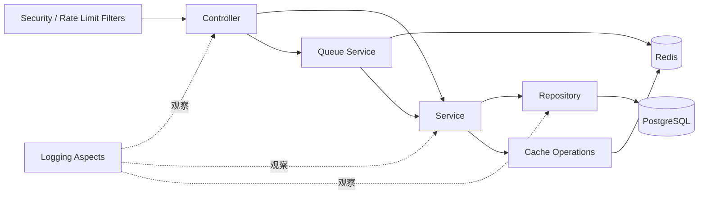
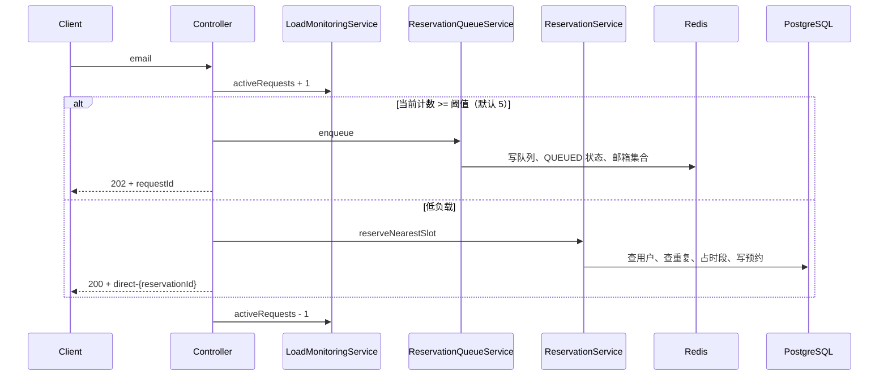

# Lab Resource Reservation 项目代码导读

> 分析对象：当前工作区 `lab-resource-reservation`  
> 分析日期：2026-09-12  
> 分析方式：目录、源码、配置、数据库迁移、容器文件、Postman 集合与测试代码的静态分析。本文会区分“设计目标”和“当前代码真实行为”。

## 1. 一句话认识项目

这是一个使用 Java 21 与 Spring Boot 3.5 编写的预约系统后端示例：用户用邮箱申请预约，系统自动分配“当前时间之后最早的空闲时段”；在并发较低时同步处理，在单实例内并发达到阈值时将请求放入 Redis 队列异步处理，并使用 PostgreSQL 保存最终数据。

虽然文件夹名是 `lab-resource-reservation`，当前领域模型没有“实验室、设备、房间、资源类型”等实体。因此，它目前更准确地说是一个**通用单资源时段预约后端原型**，而不是已经完成的多实验室资源管理系统。

## 2. 项目规模与技术栈

当前主要规模：

| 范围 | 数量 |
|---|---:|
| 生产 Java 文件 | 43 |
| 生产 Java 代码行 | 约 2,017 |
| 测试 Java 文件 | 6 |
| 测试 Java 代码行 | 约 484 |
| 主资源文件 | 6 |

主要技术：

| 领域 | 技术 | 用途 |
|---|---|---|
| 语言与运行时 | Java 21 | 使用 `List.getFirst()` 等 Java 21 API |
| Web 框架 | Spring Boot 3.5、Spring MVC | REST 接口与依赖注入 |
| 数据访问 | Spring Data JPA、Hibernate | 实体映射、查询、事务与锁 |
| 持久化 | PostgreSQL | 用户、时段和预约的最终状态 |
| 缓存与队列 | Redis、Spring Data Redis | 最近时段缓存、请求队列、状态、去重集合、死信队列 |
| 数据库版本管理 | Liquibase | 建表和初始化数据 |
| 安全 | Spring Security、JWT、BCrypt | 登录、令牌解析和密码校验 |
| 并发与恢复 | JPA 锁、`@Version`、Spring Retry | 防止并发覆盖并尝试重试 |
| 限流 | Bucket4j | 令牌桶限流 |
| 可观测性 | Actuator、Micrometer、Prometheus、Logback、AOP | 健康检查、指标和分层日志 |
| API 文档 | Springdoc OpenAPI / Swagger UI | 在线接口说明 |
| 构建与部署 | Maven、Docker、Docker Compose | 编译打包和本地编排 |

## 3. 顶层目录与文件

```text
lab-resource-reservation/
├─ src/
│  ├─ main/
│  │  ├─ java/com/azki/reservation/   # 生产代码
│  │  └─ resources/                   # 配置、日志、Liquibase
│  └─ test/                           # 单元/仓储/上下文测试
├─ .mvn/ + mvnw + mvnw.cmd            # Maven Wrapper
├─ pom.xml                             # 依赖与构建配置
├─ Dockerfile                          # 两阶段镜像构建
├─ docker-compose.yml                  # 应用 + PostgreSQL + Redis
├─ Azki_Reservation_System.postman_collection.json
│                                        # 接口调用示例（部分路径已过时）
├─ README.md                            # 英文项目概览，偏设计目标
├─ logs/                                # 本地运行日志
└─ target/                              # Maven 构建产物，不属于源代码
```

阅读时应优先看 `src/main`、`pom.xml` 和容器配置；`.idea` 是 IDE 元数据，`target` 是可再生成的构建结果，`logs` 是运行产物。

## 4. 生产代码分层

```text
com.azki.reservation
├─ ReservationApplication.java  # 应用入口，只启用了缓存和 JPA Repository
├─ controller/                  # HTTP 边界、参数校验、状态码
├─ dto/                         # API 输入输出模型
├─ service/                     # 预约、队列、缓存、过期、负载判断
├─ repository/                  # PostgreSQL 查询接口
├─ entity/                      # 数据库实体与审计字段
├─ security/                    # JWT 解析过滤器与令牌工具
├─ filter/                      # HTTP 限流过滤器
├─ config/                      # Security、Redis、指标、审计等配置
├─ aspect/                      # 通用日志、数据库日志、安全审计
└─ exception/                   # 业务异常体系
```

依赖方向大致是：



## 5. 领域模型和数据库

### 5.1 三个核心实体

`User`

- 表：`users`
- 字段：`id`、`email`、`userName`、`password`
- 用途：登录身份与预约主体。
- 注意：实体只在 `email` 上声明唯一约束，Liquibase 同时把 `email` 和 `user_name` 设置为唯一。

`AvailableSlot`

- 表：`available_slot`
- 字段：`id`、`startTime`、`endTime`、`isReserved`
- 用途：表示可分配的时间段。
- 当前模型没有关联具体实验室或资源，因此所有时段都属于一个全局资源池。

`Reservation`

- 表：`reservation`
- 字段：`id`、`user`、`availableSlot`、`reservedAt`
- 多个预约可以属于同一用户；每个时段最多只能关联一个预约。
- 数据库通过 `available_slot_id` 唯一约束保证一个时段不能出现两条预约记录。

关系图：

```mermaid
erDiagram
    USERS ||--o{ RESERVATION : makes
    AVAILABLE_SLOT ||--o| RESERVATION : assigned_to
    USERS {
        bigint id PK
        varchar email UK
        varchar user_name UK
        varchar password
        int version
    }
    AVAILABLE_SLOT {
        bigint id PK
        timestamp start_time
        timestamp end_time
        boolean is_reserved
        int version
    }
    RESERVATION {
        bigint id PK
        bigint user_id FK
        bigint available_slot_id FK_UK
        timestamp reserved_at
        int version
    }
```

### 5.2 公共审计基类

三个实体都继承 `Auditable`，自动拥有：

- `createdBy` / `createdDate`
- `lastModifiedBy` / `lastModifiedDate`
- `version`

`JpaAuditingConfig` 和 `AuditorAwareImpl` 从 Spring Security 上下文取得当前用户；没有登录用户时使用 `system`。`version` 上的 `@Version` 用于乐观锁检测。

### 5.3 Liquibase 初始化

`db.changelog-master.xml` 引入 `changeset-001.xml`，后者负责建三张表并插入三个用户、十二个时段。

需要注意：

- 两个 changeSet 的 ID 都以 `1-` 开头，但完整字符串不同，因此不构成重复标识；后续修改已执行变更集时仍需注意 Liquibase checksum。
- 初始用户密码是形如 `hashed_password_125` 的占位文本，不是 BCrypt 字符串，而登录代码使用 BCrypt 校验，因此这些种子用户通常无法成功登录。
- 初始时段全部位于 2025-10-01。以本文分析日期 2026-09-12 运行时，它们都在过去，系统会认为没有可预约时段。

## 6. 三条关键业务链路

### 6.1 登录

入口：`POST /api/auth/login`

```text
LoginRequestDto 校验邮箱和密码非空
  -> UserRepository 按邮箱查用户
  -> BCryptPasswordEncoder.matches 校验密码
  -> JwtUtil 生成有效期 24 小时的 JWT
  -> 返回 token、email、userName、expiresAt
```

`JwtFilter` 会读取 `Authorization: Bearer <token>`，验证签名后再次查用户，并把邮箱写入 SecurityContext。当前没有角色和权限集合。

### 6.2 创建预约：同步或排队

入口：`POST /api/v1/reservations/reserve`



这里的“负载”只是当前 JVM 实例内的活动预约请求数，不是 CPU、线程池、数据库或 Redis 的真实负载；多实例部署时各实例也不共享该计数。

同步分配的业务规则：

1. 按邮箱查找用户，不存在则报业务错误。
2. 查询该用户是否已有开始时间晚于当前时间的预约。
3. 获取当前时间之后最早的 `is_reserved = false` 时段。
4. 重新按 ID 读取时段并再次检查是否已占用。
5. 将时段设为已占用并保存。
6. 创建预约记录，记录 `reservedAt`。
7. 清除“最近可用时段”缓存。

返回结果只包含 `requestId` 与 `status`，不包含预约 ID 或实际分配到的时间。同步返回的 `requestId` 是 `direct-{预约ID}`，但状态查询只查 Redis，因此不能用这个 ID 查询同步请求状态。

### 6.3 队列处理与状态查询

排队所用 Redis 键：

| 键 | Redis 类型 | 含义 |
|---|---|---|
| `reservation:queue` | List | 待处理请求 |
| `reservation:dlq` | List | 重试耗尽的死信请求 |
| `reservation:emails:queued` | Set | 防止同一邮箱重复入队 |
| `reservation:status:{requestId}` | String | `QUEUED`、`PROCESSING`、`SUCCESS` 或带原因的 `FAILED` |
| `nextSlot::single`（由 Spring Cache 生成） | Cache entry | 最近可用时段缓存 |

计划中的队列流程是：定时批量从 List 左侧取出请求，调用 `ReservationService`；成功则更新状态，失败最多重试三次，最终进入 DLQ。客户端通过 `GET /api/v1/reservations/status/{requestId}` 查询状态。状态键默认保留 24 小时。

但当前入口类没有 `@EnableScheduling`，所以队列消费者、预约过期清理和 Redis 清理任务不会被调度执行。排队请求会停留在 `QUEUED`，除非在别处补充了调度启用配置。

此外，当前重试实现先执行 `leftPop` 删除当前消息，失败后却用 `list.set(0, ...)` 覆盖队首消息；达到最大次数后还会再次 `leftPop`。这会覆盖或删除下一位用户的请求，而不是可靠地重新投递当前请求。它是当前代码中最重要的数据正确性风险之一。

### 6.4 取消和过期

取消入口：`DELETE /api/v1/reservations/cancel/{id}`。

它读取预约，将关联时段设为可用，删除预约，再清除最近时段缓存。当前没有检查“当前登录用户是否拥有这条预约”。

`ReservationExpiryService` 计划每 15 分钟删除创建超过 24 小时的预约并释放时段。这里的过期依据是预约记录的 `createdDate`，不是时段开始/结束时间，也没有“到场、确认、取消”等生命周期状态。并且由于没有启用调度，当前任务不会自动执行。

## 7. Repository 与并发控制

`UserRepository`

- 自定义查询按邮箱和 ID 排序，若数据库意外存在重复邮箱，默认取第一条。
- 注释称会通过 Spring Data 自动限制一条，但查询实际返回完整 `List`，然后在 Java 中取第一条。

`ReservationRepository`

- `existsByUserEmailAndStartTimeAfter`：阻止用户同时拥有未来预约。
- `findExpiredReservations`：按创建时间找过期记录。

`TimeSlotRepository`

- 查询所有未来且未占用时段，并按开始时间排序。
- 使用 `PESSIMISTIC_WRITE` 锁，但没有数据库级 `LIMIT 1`，会把所有候选时段加载并锁定，再由 Java 取第一条。这会扩大锁范围并降低高并发吞吐量。

并发设计同时使用了悲观锁、实体 `@Version` 乐观锁、缓存和数据库唯一约束。思路是多层保护，但实现存在相互影响：

- 缓存命中时不会再次执行带悲观锁的候选查询。
- `attemptReservation` 是同类内部调用，其自身 `@Transactional` 不会经过 Spring AOP 代理；目前主要依赖外层 `reserveNearestSlot` 的事务。
- `@Retryable` 已写在方法上，但入口未启用 `@EnableRetry`，因此重试和 `@Recover` 目前不会生效。
- 发现时段已经被占用时抛出的是 `ReservationNotAvailableException`，不属于配置的乐观锁重试类型。

## 8. 缓存、限流与安全

### 8.1 最近时段缓存

`CacheableOperationsImpl` 被单独拆成 Bean，是为了避开 Spring AOP 的同类内部调用问题。所有调用共享固定键 `'single'`，每次预约成功或取消后清除。

该缓存只适用于当前“唯一全局资源池”。将来增加实验室、设备、日期或地点后，缓存键必须包含资源维度，否则不同资源会互相污染。

### 8.2 限流

当 `reservation.rate-limiting.enabled=true` 时，Bucket4j 提供一个容量 20、每分钟补充 20 个令牌的全局桶。

当前有两个实际问题：

- 主配置没有启用该属性，因此默认完全不启用限流。
- 过滤器匹配 `/api/reservations`，真实接口却位于 `/api/v1/reservations`；即使启用，预约接口也匹配不到。

限流桶还是单 JVM 全局桶，不区分用户/IP，多实例间也不共享。

### 8.3 安全边界

`SecurityConfig` 把 `/api/v1/reservations/**` 全部设为 `permitAll`，所以创建预约、查询状态和取消预约实际上都不需要 JWT。JWT 体系目前主要证明“可以登录和解析身份”，没有保护核心预约接口。

其他风险：

- JWT 密钥硬编码在 `JwtUtil` 源码中，且不能按环境轮换。
- 数据库密码明文写在 YAML 与 Compose 中。
- 取消接口按 ID 操作，没有所有权校验。
- 日志切面可能在 DEBUG/TRACE 下记录方法参数和返回值，应避免记录密码或令牌。
- 没有注册接口，用户只能来自数据库或外部初始化过程。

## 9. 异常与 HTTP 语义

`GlobalExceptionHandler` 将异常统一包装成 `ApiError`：时间、状态码、原始错误、面向客户端的消息和路径。

| 异常 | HTTP 状态 |
|---|---:|
| `DuplicateReservationException` | 409 Conflict |
| `ReservationNotAvailableException` | 404 Not Found |
| `ReservationCapacityExceededException` | 503 Service Unavailable |
| 一般 `BusinessException` | 400 Bad Request |
| `OptimisticLockingFailureException` | 409 Conflict |
| Redis 连接失败 | 503 Service Unavailable |
| 参数校验失败 | 400 Bad Request |
| 未处理异常 | 500 Internal Server Error |

`InvalidReservationTimeException` 已定义但没有被任何业务代码使用，说明“营业时间/过去时间/时长限制”等规则仍是预留设计。

## 10. 可观测性

项目通过三类机制观察运行状态：

1. Actuator/Prometheus：配置暴露 `health`、`info`、`metrics`、`prometheus`。
2. Micrometer 指标：预约成功/失败/取消、活动请求数、队列长度、DLQ 长度、队列处理和错误计数。
3. Logback + AOP：普通应用日志、安全审计日志、数据库调用耗时、事务边界与慢调用。

主要指标包括：

- `reservation.success`
- `reservation.failed`
- `reservation.cancelled`
- `reservation.active.requests`
- `reservation.queue.length`
- `reservation.dlq.length`
- `reservation.queue.processed`
- `reservation.queue.process.errors.*`
- `reservation.optimistic_locking_failures`

`MetricsConfig` 注册了 `reservation.processing.time` 和 `reservation.slot.selection.time` 两个 Timer，但业务代码没有调用它们记录耗时，所以当前只会存在空指标。

`ReservationQueueHealthIndicator` 根据队列长度返回 UP、WARNING 或 DOWN：队列超过 50 为警告，超过 100 为故障，DLQ 超过 10 为警告。

## 11. 配置与运行方式

### 11.1 本地配置

`application.yml` 默认启用 `dev` Profile，连接本机 PostgreSQL 5432 和 Redis 6379；应用 HTTP 默认是 8080，管理端点被放到 8081。

重要参数及默认值：

| 属性 | 默认值 | 含义 |
|---|---:|---|
| `reservation.request.threshold` | 5 | 达到该活动请求数后入队 |
| `reservation.queue.batch-size` | 配置为 50 | 单次轮询最多处理条数 |
| `reservation.queue.poll-interval-ms` | 配置为 10 | 队列轮询延迟（毫秒） |
| `reservation.status.expiry-hours` | 24 | 请求状态 TTL |
| `reservation.expiry.hours` | 24 | 预约创建多久后过期 |
| `reservation.expiry.check-minutes` | 15 | 过期检查周期 |

### 11.2 Docker Compose

Compose 计划启动：

- `app`：8080 暴露业务接口；
- `postgres`：PostgreSQL 15；
- `redis`：Redis 7；
- 三个命名卷分别保存日志、数据库和 Redis 数据。

当前 Compose 有两个会导致健康检查失真的不一致：

- PostgreSQL 实际用户是 `azki`，健康检查却使用 `reservation_user`。
- Actuator 管理端口是 8081，应用健康检查却访问容器 8080；且 Compose 未暴露 8081。

`Dockerfile` 使用 JDK 21 构建，再把分层 Jar 内容复制到 JRE 21 镜像运行，方向合理。

## 12. API 清单

以控制器源码为准：

| 方法 | 路径 | 请求 | 成功响应 | 当前鉴权 |
|---|---|---|---|---|
| POST | `/api/auth/login` | `email`, `password` | 200 + JWT 信息 | 无需 |
| POST | `/api/v1/reservations/reserve` | `email` | 低负载 200；高负载 202 | 无需 |
| GET | `/api/v1/reservations/status/{requestId}` | 路径参数 | 200 或 404 | 无需 |
| DELETE | `/api/v1/reservations/cancel/{id}` | 预约 ID | 204 | 无需 |

Swagger UI 计划位于 `http://localhost:8080/swagger-ui/index.html`。

仓库中的 Postman 集合仍使用 `/api/reservations` 等旧路径，与当前控制器不一致；调用时应改为上表路径。Postman 里的健康和指标 URL 也应指向管理端口 8081，除非调整应用配置。

## 13. 测试现状

测试分为：

- `ReservationServiceTest`：预约、重复预约、无时段和取消。
- `ReservationQueueServiceTest`：入队、状态、队列长度和重复入队。
- `ReservationControllerTest`：创建、查状态和取消。
- 两个 Repository 测试：未来预约判断与最近空闲时段。
- `ReservationApplicationTests`：Spring 上下文启动。

测试代码与现实现有明显漂移：

- Controller 新增了 `LoadMonitoringService` 构造参数，测试没有 Mock 它。
- Controller 返回 `ReservationResponseDto`，测试仍把整个响应对象与字符串比较。
- Service 已改为通过 `CacheableOperations` 查询时段，测试仍 Mock `TimeSlotRepository.findNextAvailable`。
- Queue 测试使用 JUnit 构造器注入普通对象，`redisCleanupService` 也没有 Mockito Mock。
- Repository 测试名为 `DataJpaTest`，但测试 Profile 指向真实 PostgreSQL，且 `pom.xml` 没有 H2 测试依赖，因此不是独立、便携的测试。
- 测试 Profile 同时使用 `ddl-auto=create-drop` 和启用 Liquibase，数据库结构职责重叠。

本次尝试运行测试时，Maven Wrapper 需要向受限的用户目录创建 Maven 安装而被拒绝；系统也没有全局 Maven，因此没有得到动态测试结果。上述判断来自源码级核对，而不是一次成功的测试执行。

## 14. 当前实现的优点

- 分层清晰，Controller、Service、Repository、DTO、Entity 职责容易定位。
- 将缓存操作拆到独立 Bean，理解了 Spring AOP 自调用限制。
- PostgreSQL 保存最终状态，Redis 只承载临时工作流，技术职责方向合理。
- 有防重复、锁、版本字段和数据库唯一约束，多层考虑了并发问题。
- 有统一异常响应、健康指标、队列状态、DLQ 和结构化日志的生产意识。
- Liquibase、Docker Compose、Swagger、Postman 和测试骨架使项目具备完整后端工程的基本形态。

## 15. 关键风险与改进优先级

### P0：先解决，否则核心流程可能不可运行或损坏请求

1. 在入口启用调度；否则 Redis 队列和两个清理任务不会运行。
2. 重写队列重试流程；当前逻辑会覆盖/删除下一条队列消息。可使用 processing queue、原子移动、确认机制或 Redis Streams。
3. 保持已执行 Liquibase changeSet 不变，通过新变更集提供有效的开发密码和未来时段数据。
4. 修正 Docker PostgreSQL 与应用健康检查。

### P1：安全与并发正确性

1. 保护预约接口，并让取消操作校验预约所有者。
2. 把 JWT 和数据库密码移到环境变量/Secret，使用足够强且可轮换的密钥。
3. 显式启用 Spring Retry，并用并发集成测试验证代理、事务、锁和缓存组合。
4. 将“选最近时段”改为数据库级只取一条，避免锁住全部可用时段；在 PostgreSQL 可考虑 `FOR UPDATE SKIP LOCKED`。
5. 队列去重的“检查后添加”不是原子操作，应使用 `SADD` 返回值完成原子抢占，并处理入队中途失败时的补偿。

### P2：接口和业务模型完整性

1. 统一控制器、README、Swagger 与 Postman 的 URL。
2. 创建预约响应应返回预约 ID、分配时段和处理模式；同步 ID 也应能被统一查询。
3. 若项目目标确为实验室预约，新增 `Resource/Lab/Room/Equipment`，让时段关联资源，并按资源维度判重、缓存和限流。
4. 建立明确状态机，例如 `PENDING`、`CONFIRMED`、`CANCELLED`、`EXPIRED`，避免用“删除记录”表达所有结束状态。
5. 明确定义过期依据；通常应基于时段、确认截止时间或状态，而非记录创建时间。

### P3：测试与可维护性

1. 先修复与实现漂移的单元测试，再添加 PostgreSQL + Redis 的 Testcontainers 集成测试。
2. 覆盖同一时段并发抢占、同邮箱同时入队、Redis 故障、进程中断、重试与 DLQ。
3. 让 Timer 真正包裹预约和选时段逻辑，或删除未使用指标。
4. 避免 `RedisTemplate.keys()` 在大数据量时阻塞；注释写的是 SCAN，但实现调用的是 `KEYS`。
5. 为日志脱敏，尤其是登录 DTO、JWT、邮箱等信息。

## 16. 推荐阅读顺序

如果目的是快速建立心智模型，建议按此顺序：

1. `pom.xml`：了解系统有哪些能力。
2. `ReservationApplication.java`：确认全局启用项。
3. `entity/` 与 Liquibase：理解数据结构和约束。
4. `ReservationController.java`：看对外功能与分流入口。
5. `ReservationService.java`：看同步预约的核心规则。
6. 三个 Repository：看规则最终如何落到数据库查询。
7. `CacheableOperationsImpl.java`：理解最近时段缓存。
8. `LoadMonitoringService.java` 与 `ReservationQueueService.java`：理解异步路径及其当前问题。
9. `SecurityConfig`、`JwtFilter`、`JwtUtil`：理解实际安全边界。
10. 过期清理、Redis 清理、健康指标和 AOP：理解后台运维能力。
11. 测试代码：一边看预期行为，一边注意它与当前实现的漂移。

## 17. 最终理解

这个仓库的核心价值是展示一个“考虑并发与运营能力的预约服务”雏形，而不是只写一个简单 CRUD。它试图把同步处理、动态排队、缓存、数据库锁、重试、死信、过期、限流、鉴权和监控放在同一个小型项目中。

不过，当前版本更接近**架构意图丰富的教学/原型项目**，还没有达到 README 所称的生产可用程度。最先应建立的不是更多功能，而是让数据库迁移、调度、队列可靠性、鉴权边界、容器健康检查和自动化测试形成一条可以重复验证的闭环。在这条闭环稳定之后，再扩展“实验室/设备/房间”等真正的资源域模型会更合适。
