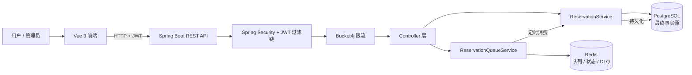

# 实验室资源预约与调度平台

一个围绕「高并发预约一致性」设计的实验室资源预约系统：Java 21 + Spring Boot 3.5 后端负责事务与并发控制，PostgreSQL 作为最终事实源，Redis 承担高负载下的异步缓冲与状态追踪，Vue 3 前端提供用户端与管理员端两套界面。

核心问题只有一个：**同一个时段，如何保证不会被两个人同时占掉**。系统围绕这一点叠加了行锁、乐观锁、重叠检测、数据库唯一约束与重试机制，并在高负载时把请求切换到 Redis 异步队列削峰。

---

## 一、项目简介

| 维度 | 说明 |
|---|---|
| 业务 | 实验室 / 会议室 / GPU / 设备的资源预约与时段调度 |
| 后端重心 | 高并发下的预约一致性、异步削峰、生命周期管理 |
| 存储分工 | PostgreSQL 存最终事实，Redis 存过程状态 |
| 前端 | 用户端闭环 + 管理员端三页管理 + 异步队列状态可视化 |
| 当前状态 | V3 完成，核心功能已实现并通过自动化测试与人工验收 |

---

## 二、技术栈

**后端**

- Java 21
- Spring Boot 3.5
- Spring Security + JWT（无状态认证与 RBAC）
- Spring Data JPA / Hibernate
- PostgreSQL 16
- Redis 7（队列、状态、缓存）
- Liquibase（数据库演进）
- Spring Retry（乐观锁冲突重试）
- Bucket4j（API 限流）
- Micrometer + Prometheus + Spring Boot Actuator
- Testcontainers（真实 PostgreSQL / Redis 集成测试）
- Maven

**前端**

- Vue 3（Composition API）
- Vite 6
- Pinia（状态管理）
- Vue Router 4（含角色路由守卫）
- Axios（统一实例 + JWT 拦截器）
- Element Plus（组件库）
- Vitest（单元测试）

---

## 三、系统角色

### USER（普通用户）

- 注册、登录
- 浏览资源与可预约时段
- 手工预约指定时段
- 自动预约（系统选择最近可用时段）
- 查看自己的预约与详情
- 取消自己的 ACTIVE 预约

### ADMIN（管理员）

- 资源管理：创建、编辑、停用
- 时段管理：单个创建、批量生成、编辑、删除
- 预约管理：查询与筛选、强制取消 ACTIVE 预约

> **角色说明**：公开注册接口只能创建 USER，客户端在请求体中传入 `role: ADMIN` 会被服务端忽略（已有专门测试用例覆盖）。ADMIN 账号通过 dev profile 的 bootstrap 机制或运维方式创建。

---

## 四、核心架构



**分工原则**

- **PostgreSQL 是唯一事实源**：预约的存在与否、状态、时段占用，一律以数据库为准
- **Redis 只是过程缓冲**：队列、请求状态、处理中集合、死信队列，全部带 TTL，可丢失、可重建
- **低负载走同步，高负载走队列**：`LoadMonitoringService` 监控当前实例活跃请求数，超过阈值 `reservation.request.threshold`（默认 5）即切换到异步路径

### 预约写链路

```text
POST /api/v1/me/reservation-requests
   |
   +-- 低负载 --> 同步写库 -------------> HTTP 200 {requestId: "direct-<id>", status: SUCCESS}
   |
   +-- 高负载 --> 写入 Redis 队列 ------> HTTP 202 {requestId: <uuid>, status: QUEUED}
                        |
                        v
                 定时轮询消费者（10ms 一批 50 条）
                        |
                        v
                 QUEUED -> PROCESSING -> SUCCESS / FAILED
                        |
                        v
                 GET /api/v1/me/reservation-requests/{requestId}
```

---

## 五、核心技术亮点

### 1. 并发预约控制（四层防护）

| 层次 | 机制 | 解决什么 |
|---|---|---|
| 1 | `SELECT ... FOR UPDATE SKIP LOCKED` 选时段 | 并发事务各自领取不同候选时段，不互相阻塞 |
| 2 | `findByIdForUpdate` 行锁 | 锁定选定时段，防止并发改写 |
| 3 | `existsOverlappingReservation` 重叠检测 | 业务层拦截用户重复占用 |
| 4 | 数据库唯一约束 + `@Version` 乐观锁 + Spring Retry | 最后一道兜底，冲突时递增退避重试 |

任何单层失效，其余层仍可保证不会出现「一个时段被两条预约占用」。

### 2. Redis 异步队列

- **状态机**：`QUEUED → PROCESSING → SUCCESS / FAILED`
- **三段结构**：等待 List、处理中 Sorted Set、死信 List（DLQ）
- **原子性**：7 段 Lua 脚本保证状态转移不会出现中间态
- **索赔回收**：`recoverStaleClaims()` 回收超过 300 秒未确认的消息，防止进程崩溃丢单
- **语义**：at-least-once —— 重复请求由业务层的重叠检测拦截，终态记为 FAILED 而非进入 DLQ
- **TTL**：请求状态 24 小时过期，过期后查询返回 404

#### 数据库侧幂等（requestId）

消息可能被重复投递，因此单靠 Redis 状态不足以保证业务只发生一次：

- **PostgreSQL 是最终事实源**，Redis 只是过程状态与缓存层
- 异步预约写入 `reservation.request_id`，并由 Liquibase changeset
  `9-reservation-request-id` 建立 `UNIQUE(request_id)` 约束 —— 该约束允许多条
  `NULL`，因此手工预约与同步直接预约不受影响
- 消费者在处理前先做应用级查询；真正的并发一致性由数据库唯一约束兜底，
  而不是「先查再写」
- 若发生唯一约束冲突，只认 `uk_reservation_request_id`，
  确认数据库已有该 requestId 后按幂等成功处理并向 Redis 恢复 `SUCCESS`；
  其他约束冲突仍按业务失败处理，不会被吞掉
- **DB 已成功但 Redis 状态丢失**时（进程崩溃、写入失败），以数据库为准恢复 `SUCCESS`

合起来可以准确描述为：**at-least-once delivery + database idempotency +
effectively-once business effect**。不应表述为 exactly-once message delivery。

#### 为什么当前选择 Redis 而不是 RabbitMQ / Kafka

这是当前场景下的工程权衡，不代表 Redis 优于消息队列：

- 系统已经依赖 Redis（缓存、限流、会话无关状态），引入新中间件会增加运维面
- 当前是单体应用、单一预约消费者、消费链路短
- 不需要长期事件保留、多消费者组或事件流 replay

演进方向：需要任务队列语义、复杂 ack / routing / 延迟队列时选 **RabbitMQ**；
需要高吞吐事件流、多消费者组、长期保留与 replay 时选 **Kafka**。

### 3. 预约生命周期

```text
ACTIVE ──> CANCELLED   （用户主动取消 / 管理员强制取消）
   │
   └──> COMPLETED      （时段结束后的终态）
```

取消会释放时段（`is_reserved` 置回 false），并写入 `cancelledAt` 与 `cancelReason`。

### 4. JWT 与 RBAC

- 无状态 JWT，角色由 `JwtFilter` 查库还原
- `/api/v1/admin/**` 需要 ADMIN 角色，其余需登录
- **请求归属校验**：异步请求状态查询会校验 owner，查询他人的 `requestId` 返回 404 而非 403（避免泄露资源是否存在）
- 前端 `role` 仅用于菜单与路由体验，后端 Spring Security 始终是最终权限来源

### 5. Liquibase 数据库演进

`src/main/resources/db/changelog/` 下按 `changeset-00N-*.xml` 顺序演进，Hibernate 设为 `ddl-auto: validate` 只校验不建表，保证 schema 与迁移脚本始终一致。

### 6. 时间模型

- **生命周期与审计字段**（`reservedAt` / `cancelledAt` / `completedAt`）：`Instant` + `timestamptz`，带时区存储
- **业务时段**（`AvailableSlot.startTime` / `endTime`）：本地业务时间，不带时区，按实验室所在时区解释

这样的分工避免了「预约时段显示差 8 小时」的经典问题，同时保留了审计时间的绝对性。

### 7. 测试

- **后端**：Testcontainers 起真实 PostgreSQL / Redis，覆盖 migration、security、concurrency、queue
- **并发测试**：CountDownLatch + 线程池验证真实竞态
- **前端 Vitest**：API 层参数构造、轮询 composable、路由守卫权限判断

---

## 六、前端功能

**用户端**

- 注册 / 登录（JWT 持久化 + 401 自动退出）
- 资源浏览与筛选
- 可预约时段查询
- 我的预约（状态筛选、详情、取消）
- **自动预约状态可视化**：按 HTTP 200 / 202 分支，202 时启动轮询并以步骤条展示 `已提交 → 排队中 → 处理中 → 成功/失败`

**管理员端**

- 资源管理（创建 / 编辑 / 停用）
- 时段管理（创建 / 批量生成 / 编辑 / 删除）
- 预约管理（查询 / 筛选 / 强制取消）

> 自动预约页的轮询逻辑抽离为独立 composable（`useReservationRequestPolling`）：间隔 1000ms、最多 60 次、终态立即停止、组件卸载与退出登录时自动清理，避免 timer 泄漏。

---

## 七、API

主要分类：

| 分类 | 路径前缀 | 说明 |
|---|---|---|
| 认证 | `/api/v1/auth/**` | 注册、登录 |
| 资源 | `/api/v1/resources` | 浏览资源 |
| 时段 | `/api/v1/slots` | 浏览可预约时段 |
| 我的预约 | `/api/v1/me/reservations` | 手工预约、列表、详情、取消 |
| 自动预约 | `/api/v1/me/reservation-requests` | 提交请求、查询请求状态 |
| 管理端 | `/api/v1/admin/**` | 资源 / 时段 / 预约管理 |

完整交互式文档：

- Swagger UI：http://localhost:8080/swagger-ui/index.html
- OpenAPI JSON：http://localhost:8080/v3/api-docs

---

## 八、本地启动

**1. 启动基础设施与后端**

```bash
docker compose up -d --build
```

- 后端 API：http://localhost:8080
- 健康检查：http://localhost:8081/actuator/health （Actuator 走独立端口 8081）

启动前需准备 `.env`（可复制 `.env.example`），至少配置 `DB_PASSWORD` 与 `JWT_SECRET`（JWT 密钥需 ≥ 32 字节）。

**2. 启动前端**

```bash
cd frontend
npm install
npm run dev
```

- 前端地址：http://localhost:5173

后端已配置 CORS 允许该来源，无需额外代理。

---

## 九、管理员开发账号

在 dev profile 中，管理员账号由 `AdminAccountInitializer` 自动创建，通过以下环境变量配置：

```text
ADMIN_EMAIL
ADMIN_USERNAME
ADMIN_PASSWORD
```

密码需满足与注册一致的强度规则（8–72 位，含大小写字母、数字与特殊符号）。

> **安全提示**：请勿在 README、配置文件或版本库中写入真实密码。`.env` 已被 `.gitignore` 排除，不会被提交。

---

## 十、测试命令

**后端**

```bash
mvnw.cmd test
```

Windows 使用 `mvnw.cmd`，macOS / Linux 使用 `./mvnw`。

**前端**

```bash
cd frontend
npm test
npm run build
```

后端集成测试依赖 Docker（Testcontainers 会临时起 PostgreSQL / Redis 容器，使用随机端口，不会与本地 5432 / 6379 冲突）。

---

## 十一、项目状态

**V3 完成。**

- 用户端闭环：注册 → 登录 → 浏览资源 → 查询时段 → 预约 → 查看 → 取消
- 自动预约：同步（200）与异步（202 + Redis 队列）双路径均已真实验证
- 管理员端：资源 / 时段 / 预约三页管理
- 后端与前端自动化测试全部通过，关键链路已人工验收

---

## 配置说明

预约与队列行为可通过 `application.yml` 调整：

```yaml
reservation:
  scheduling:
    enabled: true
  queue:
    batch-size: 50
    poll-interval-ms: 10
  status:
    expiry-hours: 24
  rate-limiting:
    enabled: true
    capacity: 20
    refill-tokens: 20
    refill-period: 1m
    max-tracked-clients: 10000
  expiry:
    check-minutes: 15
```

异步切换阈值 `reservation.request.threshold`（默认 5）可通过环境变量 `RESERVATION_REQUEST_THRESHOLD` 覆盖。

## 可观测性

```text
GET http://localhost:8081/actuator/health
GET http://localhost:8081/actuator/metrics
```

预约相关自定义指标：

```text
reservation.queue.length      队列长度
reservation.dlq.length        死信队列长度
reservation.queue.processed   已处理数量
reservation.queue.errors.*    各类错误计数
```

## 项目结构

```text
src/main/java/com/azki/reservation/
  config/       安全、Redis、限流、OpenAPI、管理员初始化
  controller/   REST 端点
  dto/          请求与响应模型（auth / admin / reservation / resource / slot）
  entity/       JPA 实体（User / Resource / AvailableSlot / Reservation）
  exception/    业务异常与全局处理
  filter/       限流、链路追踪 ID
  repository/   Spring Data 仓储（含原生行锁查询）
  security/     JWT 生成与过滤
  service/      预约核心、异步队列、查询、治理
  aspect/       日志 / 慢 SQL / 安全审计切面

frontend/src/
  api/          统一 Axios 实例与各领域 API
  composables/  轮询等可复用逻辑
  router/       路由与角色守卫
  stores/       Pinia 状态（auth）
  views/        页面（含 views/admin 管理端）
```

## License

Free To Use License (FTUL). See `LICENSE` for details.

## Author

Original Author:
**Hooman Yarahmadi** — original reservation baseline (V1)
GitHub: [@HoomanDevp](https://github.com/HoomanDevp)

Maintainer / V2 & V3 Refactor:
**&lt;Your Name&gt;** — domain model redesign, admin console, async queue hardening, Vue 3 frontend
GitHub: &lt;Your GitHub&gt;
